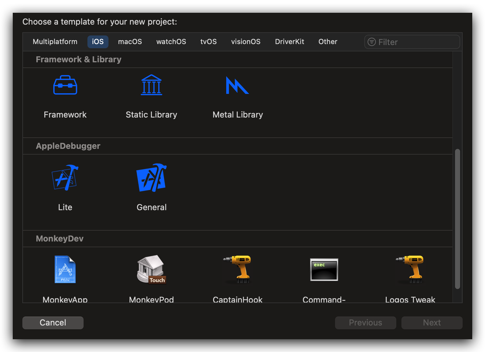

## AppleDebugger

<a href="readme.md">English</a> | <a href="readme_zh-Hans.md">简体中文</a>

### Introduction

AppleDebugger allows dynamic debugging of an IPA using Xcode, and it can be installed on non-jailbroken devices. While MonkeyDev is very useful, it requires handling various errors during installation and startup. This project aims to simplify the process and make it easier to get started.

This project draws heavily from [MonkeyDev](https://github.com/AloneMonkey/MonkeyDev).

The Lite template is suitable for basic debugging, such as when an app works fine during development and testing but encounters issues after being published to the Apple Store. You can use this template to debug by loading the dSYM symbols from the Apple Store IPA.

The General template is more suitable for debugging tasks that require writing code, such as function interception and modification.

Pro template integrates many practical tools, including http interception, anti-anti-debugging, etc. (under construction and will be released soon).

In the future, macOS app support will be provided. Some of the codes I used in trial-macOS-app will be added as template extensions.

> [!IMPORTANT]
>
> This project may undergo significant changes. Currently, it is just a preview/test version.
>
> Do not use sudo to install this project, just use an ordinary user to install it like theos.

### Installation and Uninstallation

- Clone the repository

`git clone --recursive https://github.com/TrialMacApp/AppleDebugger.git /opt/AppleDebugger`

- Install to Xcode

`/opt/AppleDebugger/install.sh`

- Uninstall (To completely uninstall, run the script below and then delete the /opt/AppleDebugger directory)

`/opt/AppleDebugger/uninstall.sh`

- Restart Xcode, and you should see the templates available when creating a new project in Xcode.

### Q&A

> [!IMPORTANT]
>
> Q: Why are there errors when starting or compiling the app?
>
> A: First, check the logs page for any error messages from AppleDebugger. If there are no AppleDebugger-related errors, try cleaning the Xcode cache and restarting Xcode. Cleaning the cache and restarting Xcode resolves 90% of error issues.
