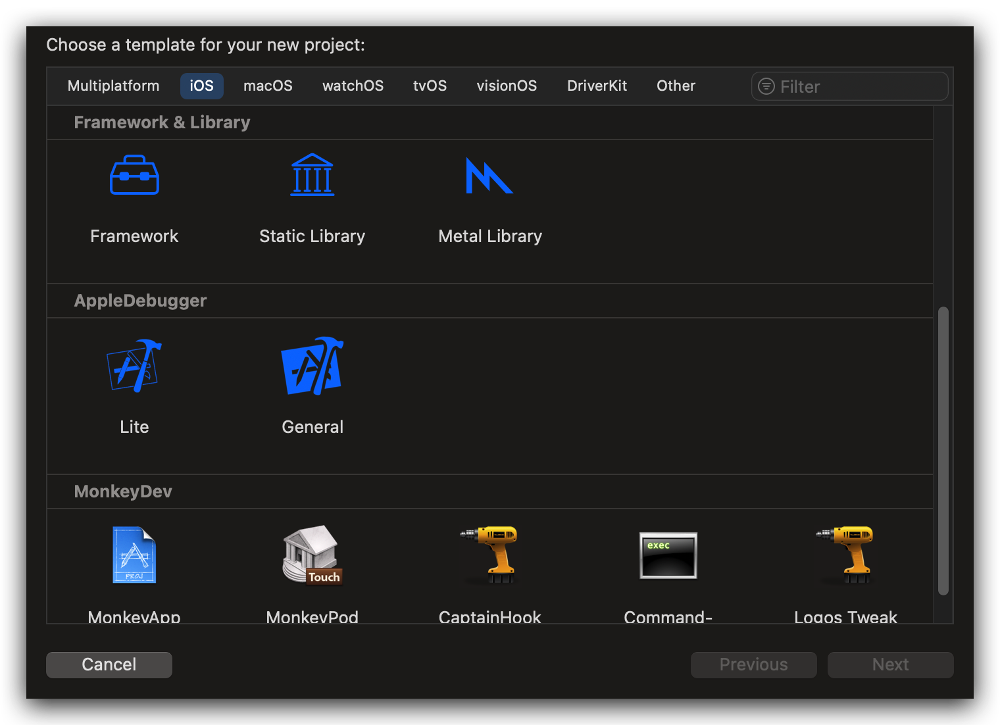

## AppleDebugger

<a href="readme.md">English</a> | <a href="readme_zh-Hans.md">简体中文</a>

### 简介

使用 Xcode 动态调试 ipa，可以安装到非越狱手机。MonkeyDev 非常好用，但是安装启动都要处理各种错误，此项目可以非常简单的启动。

此项目非常多地方都参考的 [MonkeyDev](https://github.com/AloneMonkey/MonkeyDev)

Lite 模板适合最基本的调试，比如开发和调试时 app 一切正常，发布到 Apple Store 后出现了问题，可以下载 Apple Store 的 ipa 用此模板调试，支持加载 dSYM 符号

General 模板适合需要写代码做调试，比如函数拦截修改等。

Pro 模板，集成了非常多实用工具，包括 http 拦截、反反调试等等（正在构建中，即将发布）。

未来提供 macOS app 支持，将我在 trial-macOS-app 中用到的部分代码当成模板扩展添加

> [!IMPORTANT]
>
> 此项目可能发生较大的改动，当前仅仅是预览测试版本
>
> 不要使用 sudo 安装此项目，和 theos 一样使用普通用户安装即可

### 安装卸载

- 克隆储存库

`git clone --recursive https://github.com/TrialMacApp/AppleDebugger.git /opt/AppleDebugger`

- 安装到 Xcode

`/opt/AppleDebugger/install.sh`

- 卸载 (如果要完全卸载的话，执行下面脚本后把/opt/AppleDebugger 删掉即可)

`/opt/AppleDebugger/uninstall.sh`

- 重启 Xcode，即可在 Xcode 新建项目时看到模板

### Q&A

> [!IMPORTANT]
>
> Q: 为什么启动或编译有这样那样的错误
>
> A: 先看日志页，如果没有 AppleDebugger 报的错误信息，那么就清理一下 Xcode 缓存重试，清理缓存和重启 Xcode 可以解决 90%的报错问题。
